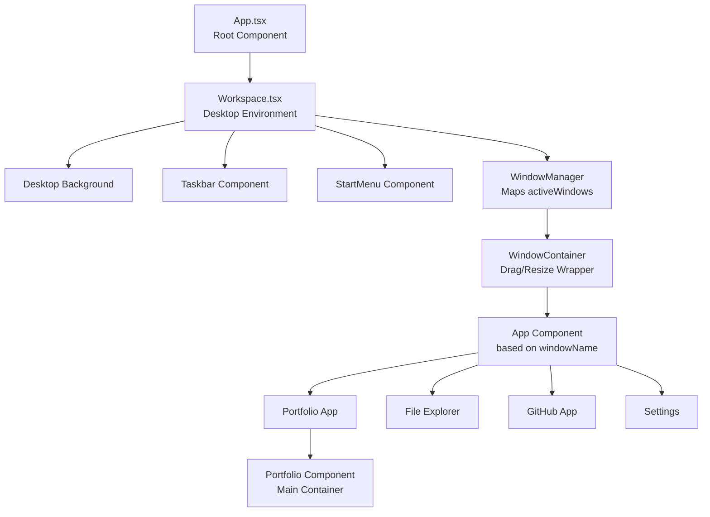
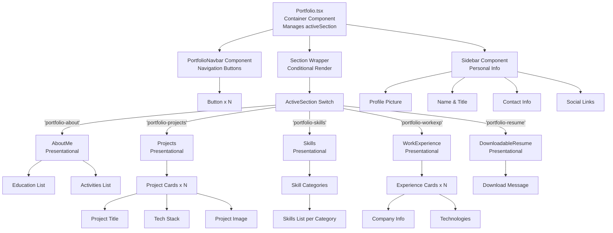
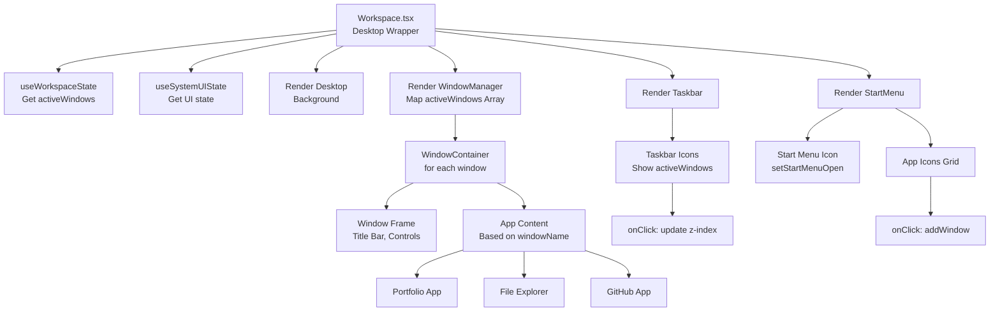
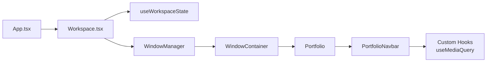
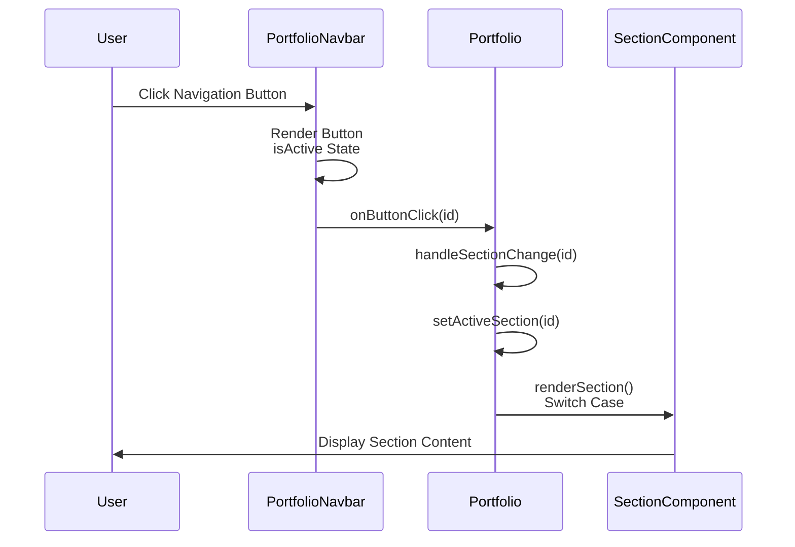
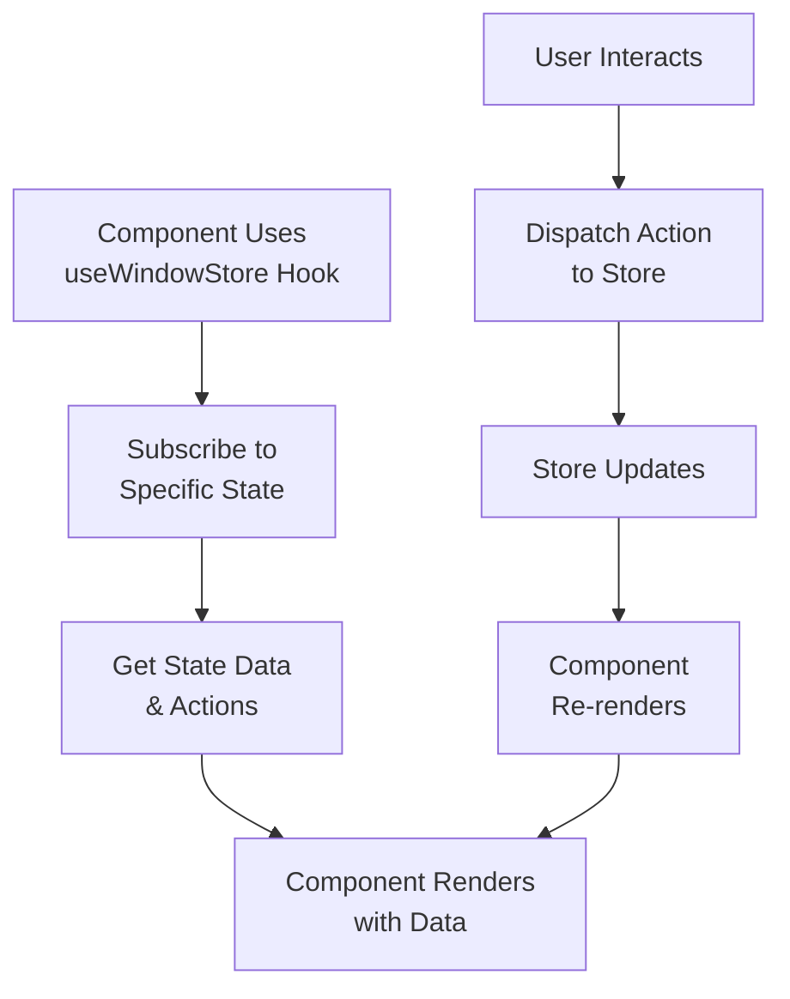
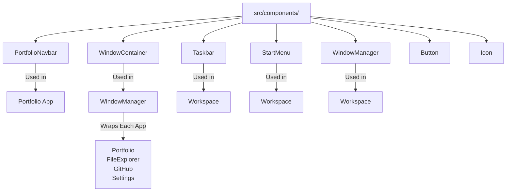
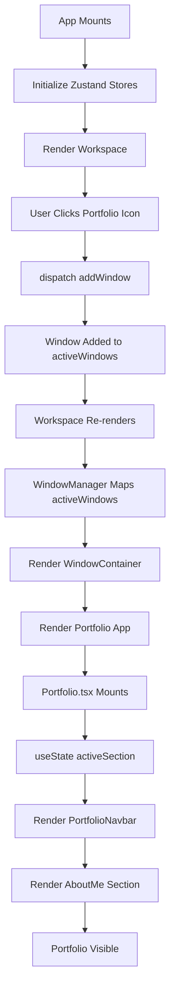

# Component Relationships

Visual representation of component hierarchy, dependencies, and data flow between components.

---

## Overall Application Hierarchy



---

## Portfolio Component Tree



---

## Desktop Environment Structure



---

## Component Dependency Graph



---

## Data Flow Between Components

### Portfolio Navigation Flow



### Store Integration



---

## Component Props Flow

### Portfolio Props Passing

```mermaid
graph TD
    A["Portfolio.tsx"]

    A -->|buttons: ButtonDetailProps[]| B["PortfolioNavbar"]
    A -->|onButtonClick: function| B

    B -->|Button Props| B1["Individual Button"]
    B1 -->|onClick| B2["Trigger Parent Callback"]

    A -->|PROJECTS_DATA| C["Projects Component"]
    A -->|SKILLS.items| D["Skills Component"]
    A -->|ABOUT_ME_DETAILS| E["AboutMe Component"]
    A -->|WORK_EXPERIENCE_DETAILS| F["WorkExperience Component"]
```

---

## Reusable Components Location



---

## Hierarchy Summary by Type

### Container Components

- `App.tsx` - Root
- `DefaultApp.tsx` - Desktop wrapper
- `Portfolio.tsx` - Portfolio main
- `PortfolioSection.tsx` - Conditional renderer (alternate)

### Presentational Components

- `PortfolioNavbar` - Navigation
- `Sidebar` - Info display
- `AboutMe` - About section
- `Projects` - Projects section
- `Skills` - Skills section
- `WorkExperience` - Experience section
- `DownloadableResume` - Resume section

### Shared/UI Components

- `Window` - Window frame
- `TaskBar` - Bottom taskbar
- `StartMenu` - App launcher
- `Button`, `Icon`, etc. - Basic UI

---

## Component Communication Patterns

### Direct Props (Parent → Child)

```
Portfolio.tsx
  ↓
  PortfolioNavbar (receives buttons, onButtonClick)
  ↓
  Button (receives id, name, isActive)
```

### Callbacks (Child → Parent)

```
Button.onClick()
  ↓
  PortfolioNavbar.onButtonClick(id)
  ↓
  Portfolio.handleSectionChange(id)
```

### Store (Global State)

```
useWindowStore Hook
  ↓
  Available in any component
  ↓
  Dispatch actions to update
```

### Context (if used)

```
ThemeContext
  ↓
  Wraps tree
  ↓
  useContext(ThemeContext)
```

---

## Lifecycle: From App Start to Portfolio Display



---
