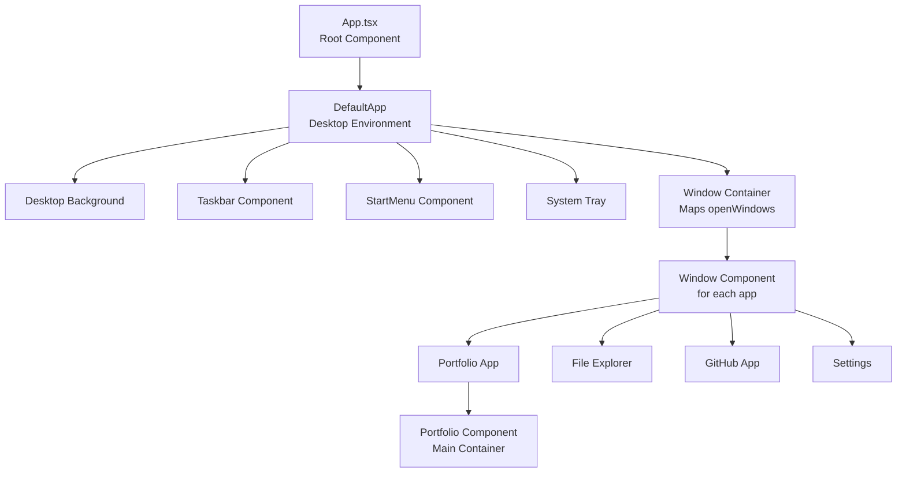
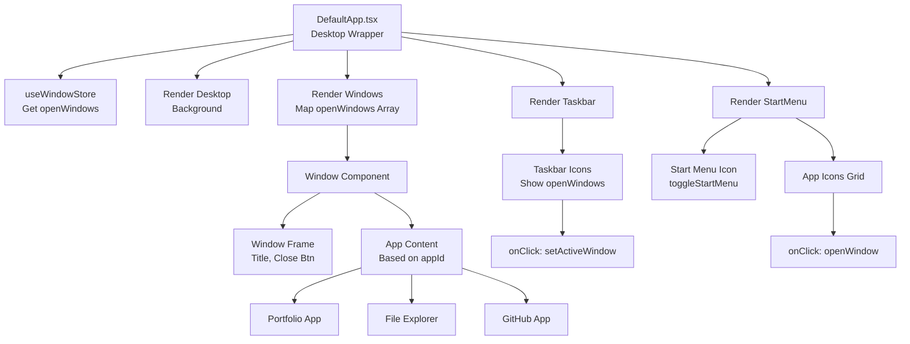
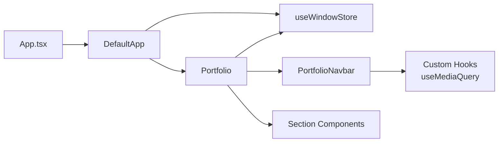
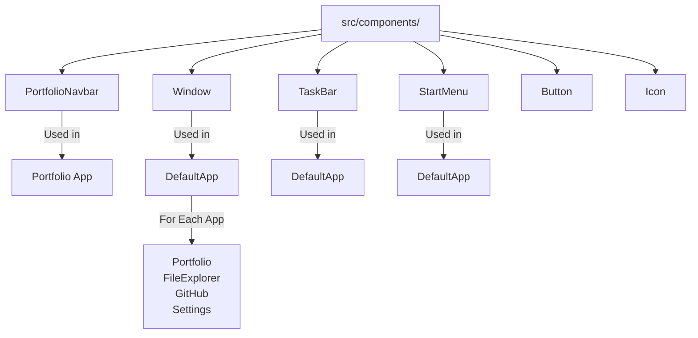
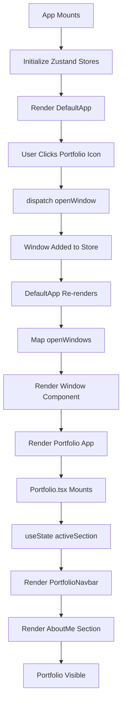

# Component Relationships

Visual representation of component hierarchy, dependencies, and data flow between components.

---

## Overall Application Hierarchy



---

## Portfolio Component Tree


---

## Desktop Environment Structure



---

## Component Dependency Graph



---

## Data Flow Between Components

### Portfolio Navigation Flow


### Store Integration


---

## Component Props Flow

### Portfolio Props Passing

```mermaid
graph TD
    A["Portfolio.tsx"]

    A -->|buttons: ButtonDetailProps[]| B["PortfolioNavbar"]
    A -->|onButtonClick: function| B

    B -->|Button Props| B1["Individual Button"]
    B1 -->|onClick| B2["Trigger Parent Callback"]

    A -->|PROJECTS_DATA| C["Projects Component"]
    A -->|SKILLS.items| D["Skills Component"]
    A -->|ABOUT_ME_DETAILS| E["AboutMe Component"]
    A -->|WORK_EXPERIENCE_DETAILS| F["WorkExperience Component"]
```

---

## Reusable Components Location



---

## Hierarchy Summary by Type

### Container Components
- `App.tsx` - Root
- `DefaultApp.tsx` - Desktop wrapper
- `Portfolio.tsx` - Portfolio main
- `PortfolioSection.tsx` - Conditional renderer (alternate)

### Presentational Components
- `PortfolioNavbar` - Navigation
- `Sidebar` - Info display
- `AboutMe` - About section
- `Projects` - Projects section
- `Skills` - Skills section
- `WorkExperience` - Experience section
- `DownloadableResume` - Resume section

### Shared/UI Components
- `Window` - Window frame
- `TaskBar` - Bottom taskbar
- `StartMenu` - App launcher
- `Button`, `Icon`, etc. - Basic UI

---

## Component Communication Patterns

### Direct Props (Parent → Child)
```
Portfolio.tsx
  ↓
  PortfolioNavbar (receives buttons, onButtonClick)
  ↓
  Button (receives id, name, isActive)
```

### Callbacks (Child → Parent)
```
Button.onClick()
  ↓
  PortfolioNavbar.onButtonClick(id)
  ↓
  Portfolio.handleSectionChange(id)
```

### Store (Global State)
```
useWindowStore Hook
  ↓
  Available in any component
  ↓
  Dispatch actions to update
```

### Context (if used)
```
ThemeContext
  ↓
  Wraps tree
  ↓
  useContext(ThemeContext)
```

---

## Lifecycle: From App Start to Portfolio Display



---

## Component Size & Responsibility

| Component | Size | Responsibility |
|-----------|------|-----------------|
| **App.tsx** | Small | Root, setup |
| **DefaultApp.tsx** | Medium | Desktop wrapper |
| **Portfolio.tsx** | Medium | Section management |
| **PortfolioNavbar** | Small | Navigation UI |
| **Sidebar** | Small | Info display |
| **AboutMe** | Small | Content display |
| **Projects** | Medium | List + cards |
| **Skills** | Small | Grid display |
| **WorkExperience** | Medium | List + cards |

---

## Anti-Patterns to Avoid

### ❌ Props Drilling Too Deep
```
Parent → Child1 → Child2 → Child3 → Child4
With props that only Child4 uses
```
**Solution:** Use store or context

### ❌ Logic in Presentational Components
```
// ❌ Wrong
function ProjectCard({ project }) {
  const [expanded, setExpanded] = useState(false);
  const formattedDate = formatDate(project.date);
  return ...
}
```
**Solution:** Keep presentation, move logic to parent

### ❌ Circular Dependencies
```
ComponentA imports ComponentB
ComponentB imports ComponentA
```
**Solution:** Extract shared logic to separate file

---

## Best Practices Applied

✅ **Separation of Concerns**
- Container components handle logic
- Presentational components handle UI

✅ **Single Responsibility**
- Each component has one main job
- Sidebar displays info, Portfolio manages state

✅ **Reusability**
- Common components in `/components/`
- Used across different sections

✅ **Type Safety**
- Props interfaces defined
- No implicit prop types

✅ **Responsive**
- Mobile-first design
- Hooks like `useMediaQuery` for adaptation

---

## Related Documentation

- [Implementation Details](./IMPLEMENTATION_DETAILS.md) - Code patterns
- [Data Flow](./DATA_FLOW.md) - How data flows
- [UI Flow](./UI_FLOW.md) - User interactions
- [Feature Walkthroughs](./FEATURE_WALKTHROUGHS.md) - Real examples
- [Design & Architecture](./DESIGN_AND_ARCHITECTURE.md) - Overview
