# Data Flow

How data moves through Portfolio OS - from initialization through user interactions to the final UI render.

---

## Initialization Data Flow

### From App Load to Desktop Ready

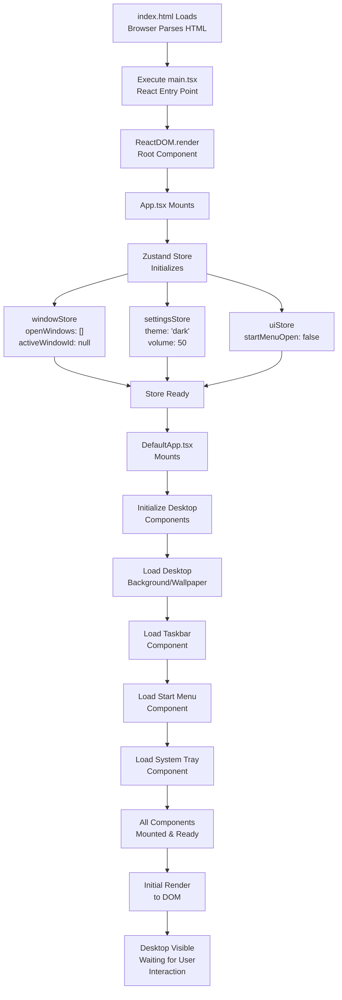

### Constants Loading

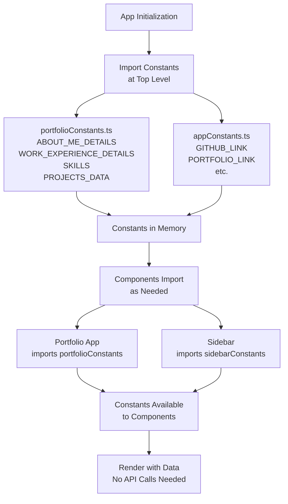

---

## Global State Management

### Zustand Store Architecture

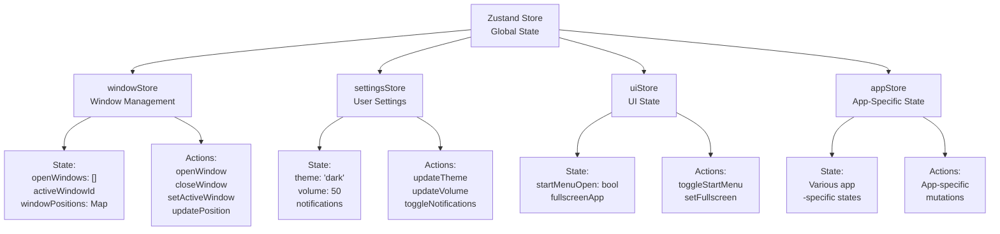

---

## Component Subscription Model

### How Components Access Store Data

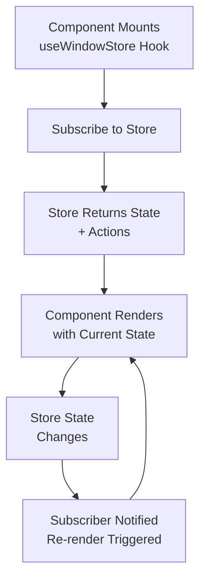

**Example Code Pattern:**
```typescript
function MyComponent() {
  // Subscribe to specific parts of store
  const windows = useWindowStore((state) => state.openWindows);
  const closeWindow = useWindowStore((state) => state.closeWindow);

  // Component has data and actions
  return (
    <div>
      {windows.map(w => (
        <button onClick={() => closeWindow(w.id)}>
          {w.appId}
        </button>
      ))}
    </div>
  );
}
```

---

## Application-Level Data Flow

### Complete Desktop System

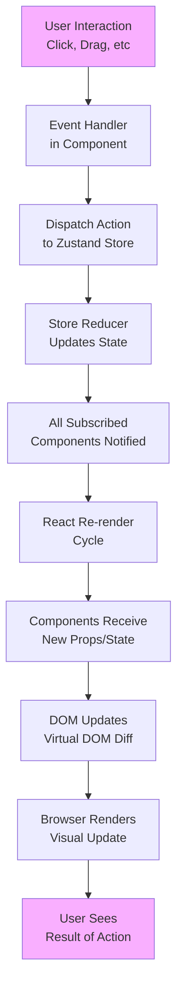

---

## Window Management Data Flow

### Opening a Window

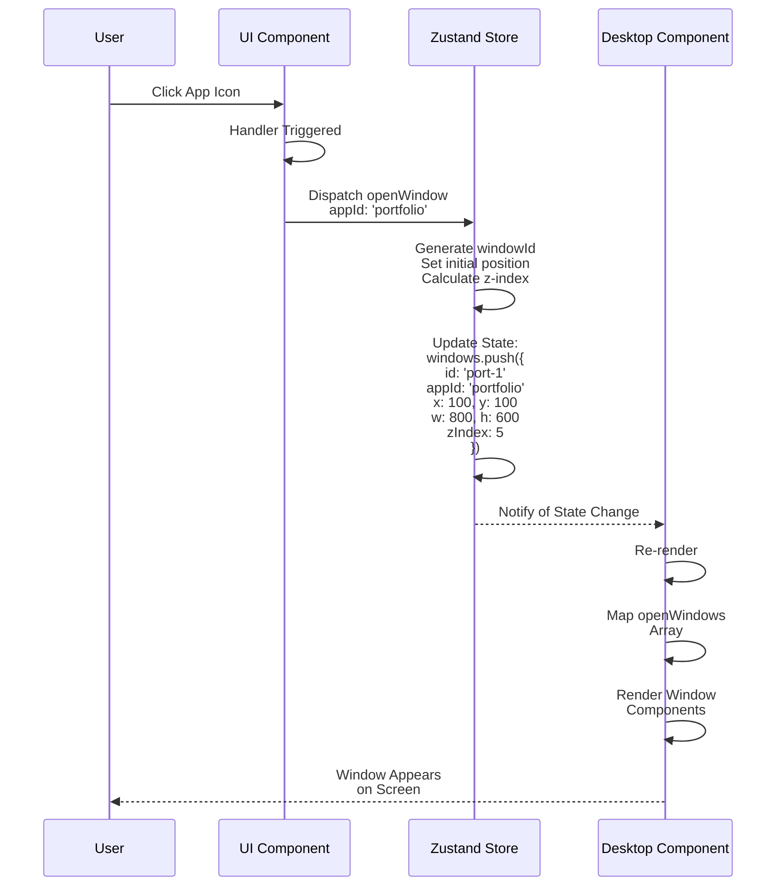

**State Shape:**
```typescript
interface WindowInstance {
  id: string;              // 'port-1'
  appId: string;           // 'portfolio-default'
  position: { x: number; y: number };
  size: { width: number; height: number };
  zIndex: number;
  isMinimized: boolean;
  // ... other properties
}

// Store state
{
  openWindows: WindowInstance[],
  activeWindowId: string | null
}
```

---

### Updating Window Position (Drag)

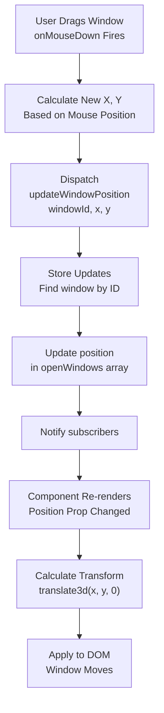

---

## Portfolio Application Data Flow

### State Management

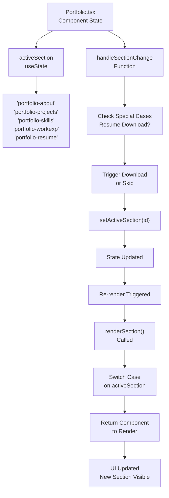

**Component Structure:**
```typescript
function Portfolio() {
  const [activeSection, setActiveSection] = useState('portfolio-about');

  const handleSectionChange = (id) => {
    // Special logic for resume
    if (id === 'portfolio-resume') {
      triggerDownload();
    }
    setActiveSection(id);
  };

  const renderSection = () => {
    switch(activeSection) {
      case 'portfolio-about': return <AboutMe />;
      case 'portfolio-projects': return <Projects />;
      // ... other cases
    }
  };

  return (
    <div className="portfolio">
      <PortfolioNavbar onButtonClick={handleSectionChange} />
      <div className="section-wrapper">
        {renderSection()}
      </div>
    </div>
  );
}
```

---

## Props Drilling & Data Passing

### Navbar → Section Navigation

```mermaid
graph TD
    A["Portfolio.tsx"]
    A -->|Pass Props| B["PortfolioNavbar"]
    A -->|Pass Props| C["Section Component"]

    B -->|buttons: []| B1["ButtonDetailProps[]"]
    B1 --> B2["id: string"]
    B1 --> B3["name: string"]
    B1 --> B4["isActive: boolean"]
    B1 --> B5["onButtonClick: function"]

    B -->|onButtonClick| B5

    B5 -->|User Clicks| B6["onButtonClick(id)"]
    B6 -->|Calls| A
    A -->|handleSectionChange(id)| A1["Updates State<br/>& Renders"]

    C -->|portfolioData| C1["Props specific to<br/>section component"]
```

---

## Resume Download Data Flow

### Complete Download Process

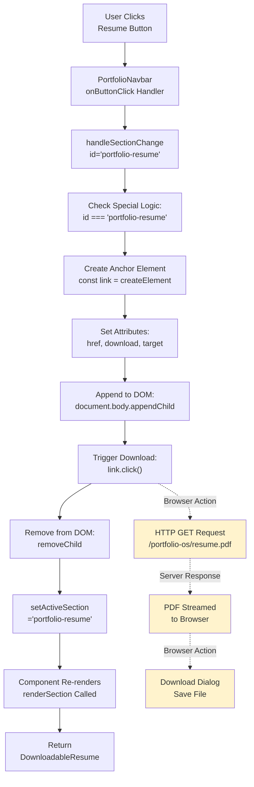

---

## Section Component Data Flow

### AboutMe Component Example

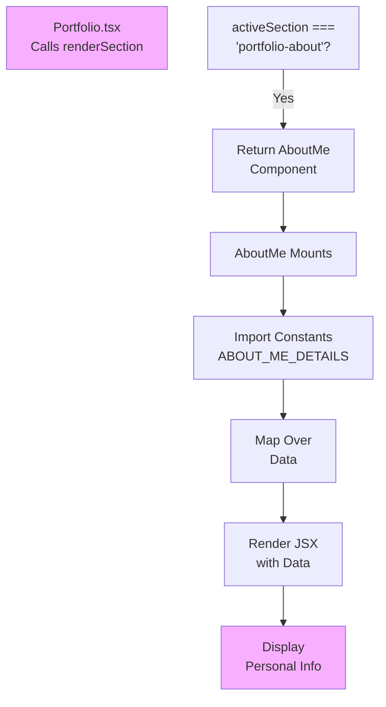

**Data Source Flow:**
```
src/constants/portfolioConstants.ts
  ↓
  ABOUT_ME_DETAILS
  ↓
  AboutMe.tsx (import)
  ↓
  Component Uses Data
  ↓
  Render UI
```

---

## Responsive Design Data Flow

### Mobile Detection & Adaptation

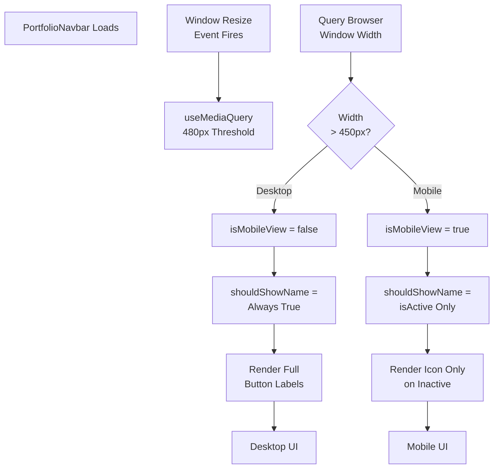

**Code Implementation:**
```typescript
const isMobileView = useMediaQuery('(max-width: 450px)');
const shouldShowName = !isMobileView || item.isActive;
```

---

## Unidirectional Data Flow Summary

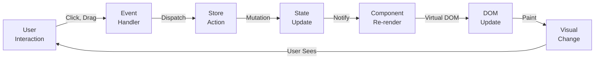

---

## Data Consistency Patterns

### Preventing Data Corruption

**Pattern 1: Immutable Updates**
```typescript
// ❌ WRONG - Mutating state directly
state.windows[0].x = 100;

// ✅ CORRECT - Creating new object
set({
  windows: state.windows.map(w =>
    w.id === windowId ? {...w, x: 100} : w
  )
});
```

**Pattern 2: Single Source of Truth**
```typescript
// All window state in ONE store
useWindowStore.getState().openWindows

// NOT scattered in multiple components
const [windows, setWindows] = useState([]); // ❌ Avoid
```

**Pattern 3: Derived Data**
```typescript
// Compute in component, don't store
const activeWindow = windows.find(
  w => w.id === activeWindowId
);

// NOT in store state
activeWindow: {...}  // ❌ Creates inconsistency
```

---

## Performance: Data Flow Optimization

### Selector Optimization

```typescript
// ❌ Creates new array every render
const windows = useWindowStore((state) => state.windows);

// ✅ Only re-render when windows actually changes
const windows = useWindowStore(
  (state) => state.windows,
  (prev, next) => prev === next  // Shallow compare
);
```

### Subscription Efficiency

```typescript
// ❌ Subscribes to entire store
const allState = useWindowStore();

// ✅ Only subscribes to needed data
const windows = useWindowStore(state => state.windows);
```

---

## Data Sources

| Data Type | Source | Access | Example |
|-----------|--------|--------|---------|
| **Window State** | Zustand Store | `useWindowStore()` | Open windows, positions |
| **Settings** | Zustand Store | `useSettingsStore()` | Theme, volume |
| **Portfolio Data** | Constants File | `import { ... }` | About, projects, skills |
| **Component State** | React useState | `useState()` | Active section |
| **Dynamic State** | Computed | Function | Filtered lists |

---

## Related Documentation

- [UI Flow](./UI_FLOW.md) - How users interact with the UI
- [Component Relationships](./COMPONENT_RELATIONSHIPS.md) - Component connections
- [Implementation Details](./IMPLEMENTATION_DETAILS.md) - Code implementation
- [Feature Walkthroughs](./FEATURE_WALKTHROUGHS.md) - Step-by-step examples
- [Design & Architecture](./DESIGN_AND_ARCHITECTURE.md) - Main overview
