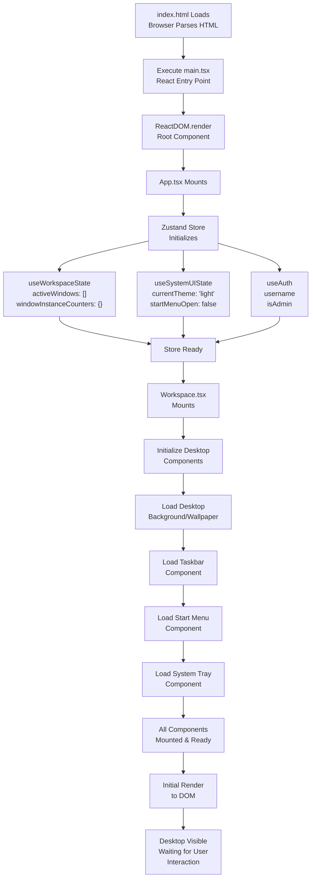
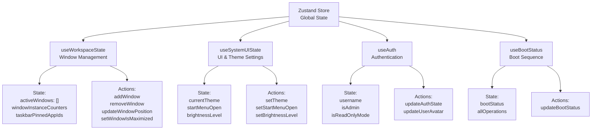
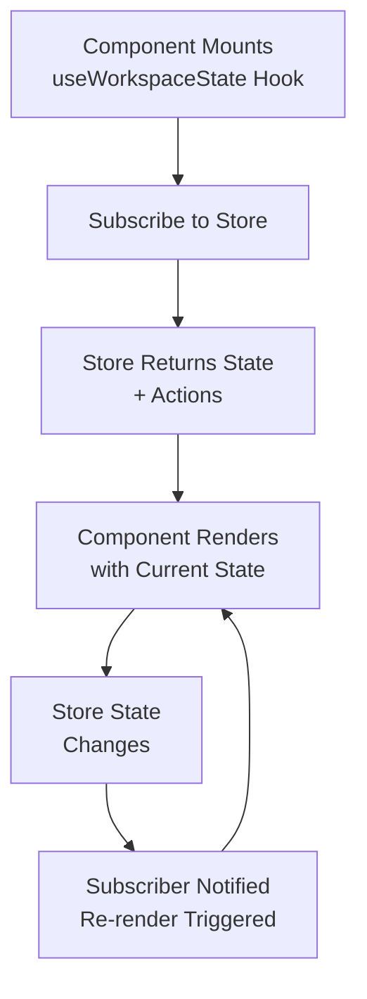
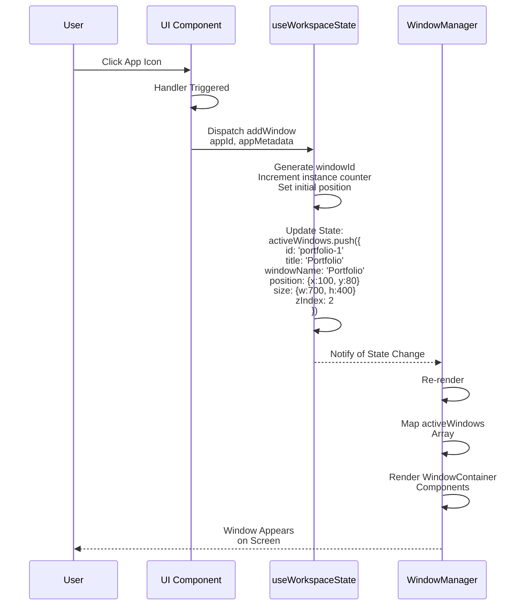

# Data Flow

How data moves through Portfolio OS - from initialization through user interactions to the final UI render.

---

## Initialization Data Flow

### From App Load to Desktop Ready



### Constants Loading


---

## Global State Management

### Zustand Store Architecture



---

## Component Subscription Model

### How Components Access Store Data



**Example Code Pattern:**

```typescript
function WindowManager() {
  // Subscribe to specific parts of store
  const activeWindows = useWorkspaceState((state) => state.activeWindows);
  const removeWindow = useWorkspaceState((state) => state.removeWindow);

  // Component has data and actions
  return (
    <>
      {activeWindows.map(w => (
        <WindowContainer key={w.id} windowId={w.id}>
          {/* Window content */}
        </WindowContainer>
      ))}
    </>
  );
}
```

---

## Application-Level Data Flow

### Complete Desktop System


---

## Window Management Data Flow

### Opening a Window



**State Shape:**

```typescript
interface WindowData {
  id: string;              // 'portfolio-1'
  title: string;           // 'Portfolio'
  windowName: string;      // 'Portfolio' (maps to app in WindowManager)
  position: { x: number; y: number };
  size: { width: number; height: number };
  zIndex: number;
  isMaximized: WindowDisplayType; // 'normal' | 'maximized' | 'minimized'
  // ... other properties
}

// Store state
{
  activeWindows: WindowData[],
  windowInstanceCounters: Record<string, number>
}
```

---

### Updating Window Position (Drag)


---

## Portfolio Application Data Flow

### State Management


**Component Structure:**

```typescript
function Portfolio() {
  const [activeSection, setActiveSection] = useState('portfolio-about');

  const handleSectionChange = (id) => {
    // Special logic for resume
    if (id === 'portfolio-resume') {
      triggerDownload();
    }
    setActiveSection(id);
  };

  const renderSection = () => {
    switch(activeSection) {
      case 'portfolio-about': return <AboutMe />;
      case 'portfolio-projects': return <Projects />;
      // ... other cases
    }
  };

  return (
    <div className="portfolio">
      <PortfolioNavbar onButtonClick={handleSectionChange} />
      <div className="section-wrapper">
        {renderSection()}
      </div>
    </div>
  );
}
```

---

## Props Drilling & Data Passing

### Navbar → Section Navigation

```mermaid
graph TD
    A["Portfolio.tsx"]
    A -->|Pass Props| B["PortfolioNavbar"]
    A -->|Pass Props| C["Section Component"]

    B -->|buttons: []| B1["ButtonDetailProps[]"]
    B1 --> B2["id: string"]
    B1 --> B3["name: string"]
    B1 --> B4["isActive: boolean"]
    B1 --> B5["onButtonClick: function"]

    B -->|onButtonClick| B5

    B5 -->|User Clicks| B6["onButtonClick(id)"]
    B6 -->|Calls| A
    A -->|handleSectionChange(id)| A1["Updates State<br/>& Renders"]

    C -->|portfolioData| C1["Props specific to<br/>section component"]
```

---

## Resume Download Data Flow

### Complete Download Process


---

## Section Component Data Flow

### AboutMe Component Example


**Data Source Flow:**

```
src/constants/portfolioConstants.ts
  ↓
  ABOUT_ME_DETAILS
  ↓
  AboutMe.tsx (import)
  ↓
  Component Uses Data
  ↓
  Render UI
```

---

## Responsive Design Data Flow

### Mobile Detection & Adaptation


**Code Implementation:**

```typescript
const isMobileView = useMediaQuery('(max-width: 450px)');
const shouldShowName = !isMobileView || item.isActive;
```

---

## Unidirectional Data Flow Summary


---

## Data Sources

| Data Type           | Source         | Access                | Example                      |
| ------------------- | -------------- | --------------------- | ---------------------------- |
| **Window State**    | Zustand Store  | `useWorkspaceState()` | Active windows, positions    |
| **UI State**        | Zustand Store  | `useSystemUIState()`  | Theme, brightness, startMenu |
| **Auth State**      | Zustand Store  | `useAuth()`           | Username, admin status       |
| **Portfolio Data**  | Constants File | `import { ... }`      | About, projects, skills      |
| **Component State** | React useState | `useState()`          | Active section               |
| **Dynamic State**   | Computed       | Function              | Filtered lists               |

---
