# UI Flow

Visual representation of user interactions, screen navigation, and state transitions in Portfolio OS.

## Overview

Portfolio OS has three main navigation contexts:

1. **Application Startup** - Initialization and desktop boot
2. **Desktop Environment** - The window system (Taskbar, Start Menu, Windows)
3. **Portfolio Application** - The main app with multiple sections

---

## Application Startup & Initialization

### From App Launch to Desktop Ready

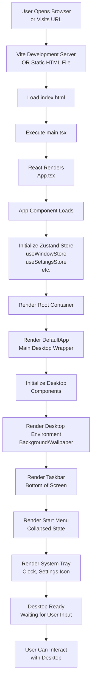

**Code Entry Points:**

- `src/main.tsx` - React app entry
- `src/App.tsx` - Root component
- `src/screens/Workspace/Workspace.tsx` - Desktop environment
- `src/components/WindowManager/WindowManager.tsx` - Window management

---

### Store Initialization

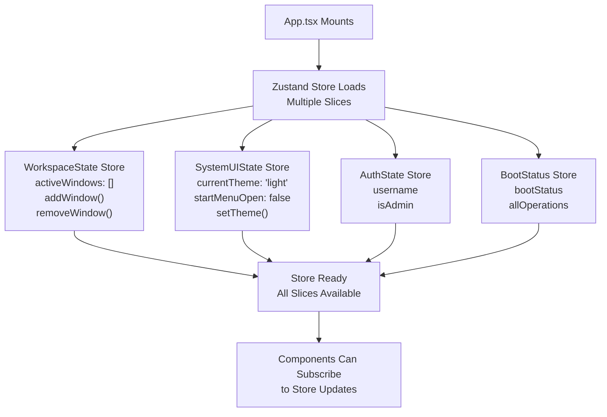

---

## Desktop Environment Flow

### Desktop Interaction States

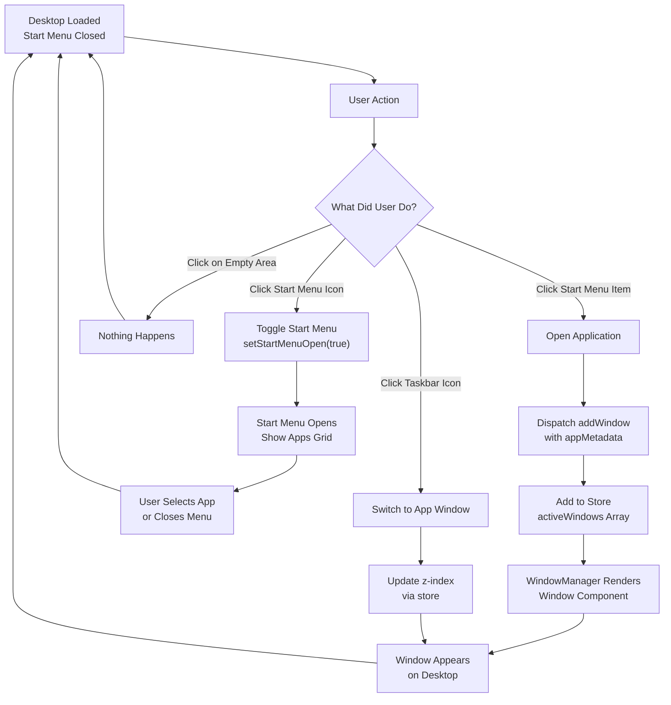

### Start Menu Opening/Closing

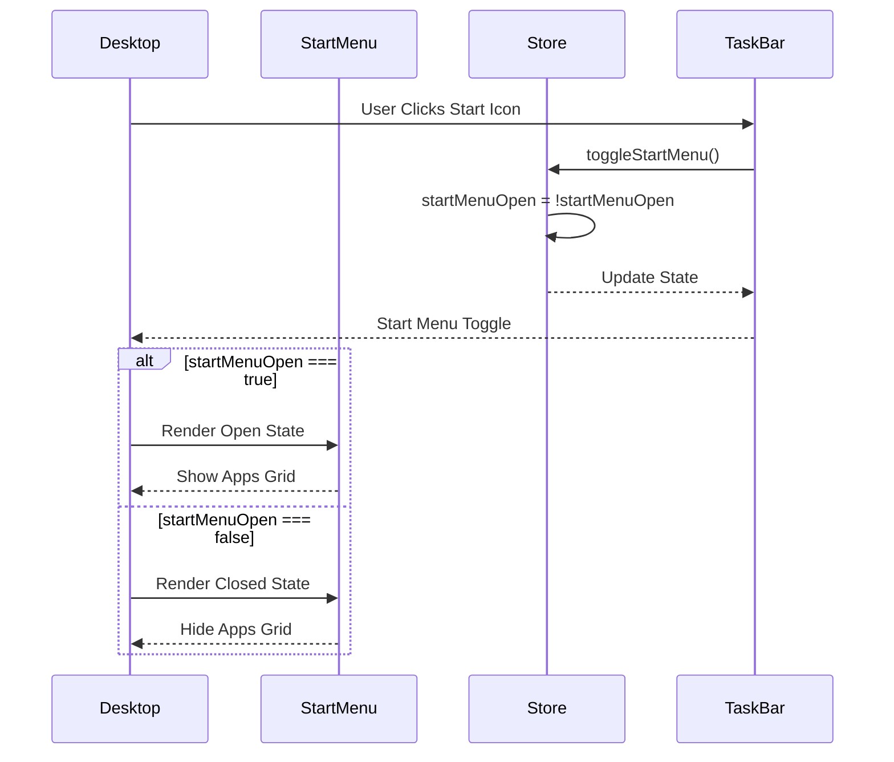

### Opening an Application (Portfolio)

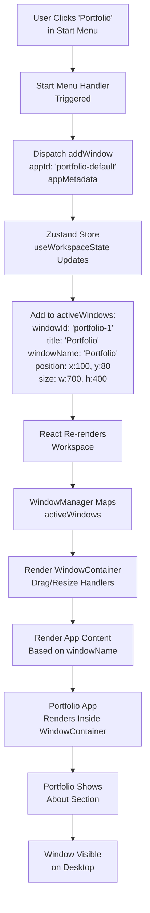

---

## Portfolio Application Flow

### Section Navigation

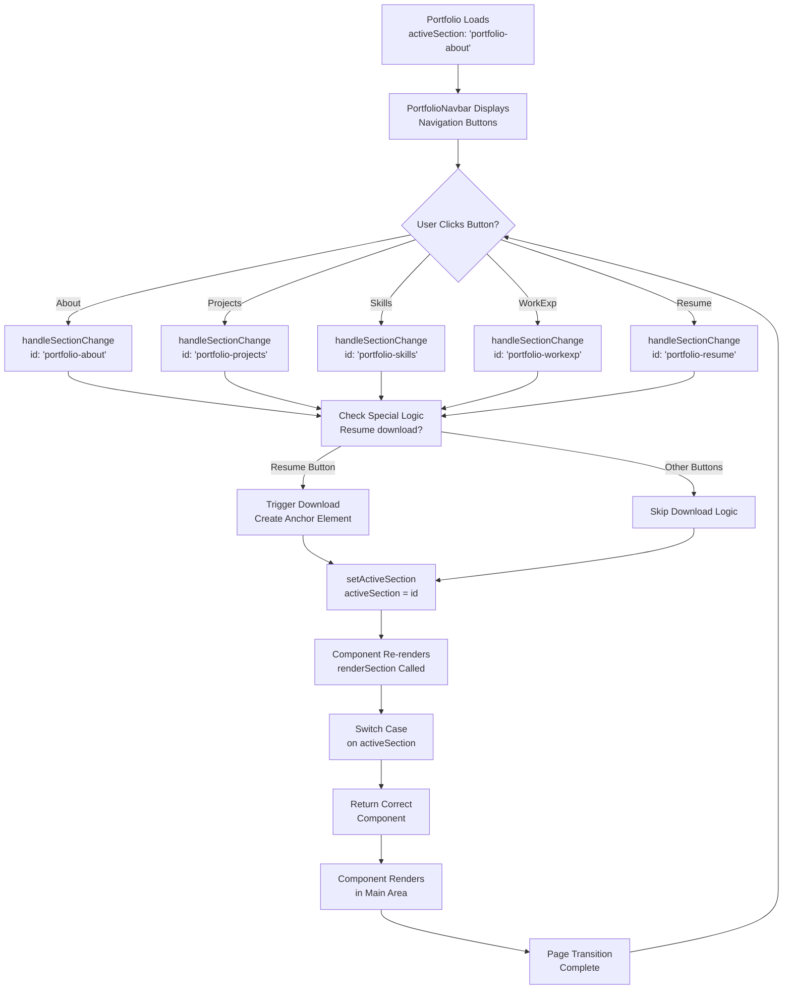

### Resume Download Flow (Complete)

```mermaid
graph TD
    A["User Clicks Resume<br/>Button in PortfolioNavbar"]
    B["onButtonClick Fires<br/>Calls handleSectionChange"]
    A --> B

    B --> C["handleSectionChange<br/>receives id='portfolio-resume'"]
    C --> D{"Check ID:<br/>id === 'portfolio-resume'?"}

    D -->|YES - Resume Button| E["Special Logic:<br/>Download Resume"]
    D -->|NO - Other Button| K["Skip to Normal Flow"]

    E --> F["Create Temporary<br/>Anchor &lt;a&gt; Element"]
    F --> G["Set Element href<br/>to '/portfolio-os/<br/>Rohit_Resume_<br/>Frontend_2.pdf'"]

    G --> H["Set download<br/>Attribute to<br/>Custom Filename"]
    H --> I["Append to<br/>document.body<br/>ADD to DOM"]

    I --> J["Trigger .click()<br/>Browser Download"]
    J --> J1["Browser Request<br/>GET /portfolio-os/resume.pdf"]
    J1 --> J2["Server Responds<br/>with PDF file"]
    J2 --> J3["Browser Shows<br/>Save Dialog"]
    J3 --> J4["User Saves<br/>to Computer"]

    J4 --> K["Remove Element<br/>from DOM"]
    K --> L["Call setActiveSection<br/>activeSection =<br/>'portfolio-resume'"]

    L --> M["React Re-renders<br/>Portfolio Component"]
    M --> N["renderSection()<br/>Called"]
    N --> O["Return<br/>DownloadableResume<br/>Component"]
    O --> P["Render Message:<br/>'Your resume is<br/>being downloaded...'"]
    P --> Q["Portfolio Shows<br/>Resume Section"]
```

---

## Window Management Flow

### Window Interaction Lifecycle

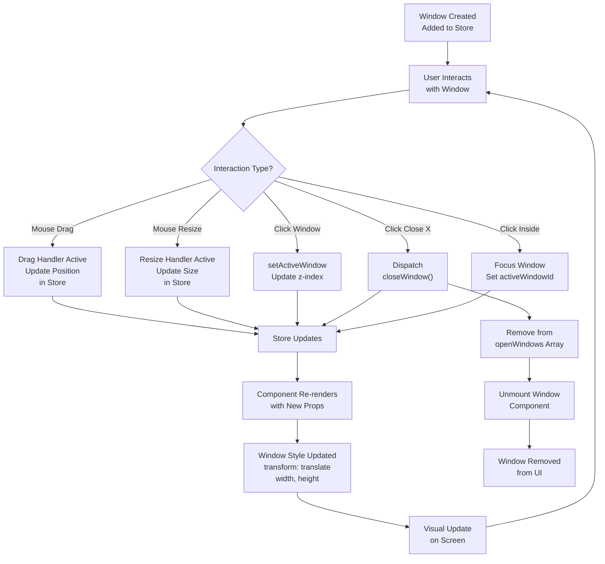

---

## Component Rendering Pipeline

### Portfolio Component Lifecycle

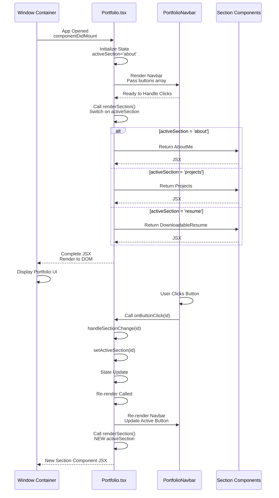

---

## Responsive UI Flow

### Mobile vs Desktop Adaptation

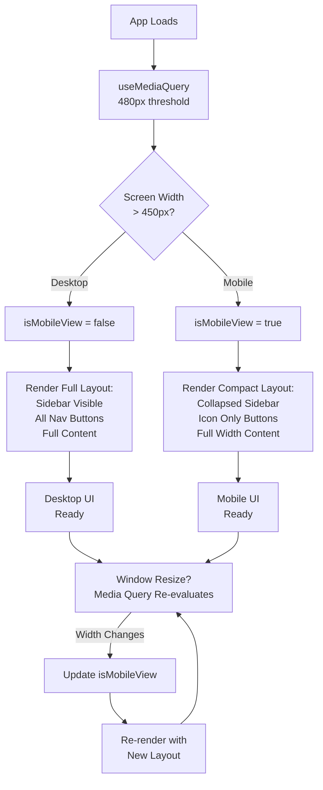

**PortfolioNavbar responsive logic:**

```typescript
const isMobileView = useMediaQuery('(max-width: 450px)');
const shouldShowName = !isMobileView || item.isActive;
```

---

## Error & Edge Cases

### Resume File Not Found

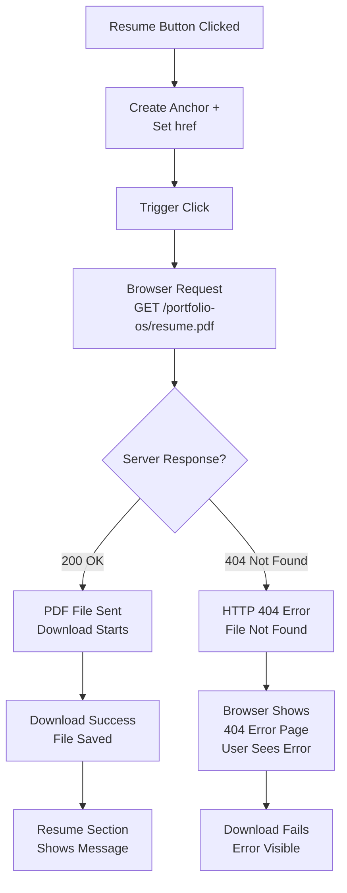

---

## Complete User Journey Example

### From App Load to Portfolio Navigation

```
1. User Opens Browser
   ↓
2. App.tsx Mounts
   ↓
3. Zustand Store Initializes
   ↓
4. Desktop Environment Renders
   ├── Background
   ├── Taskbar
   ├── Start Menu (closed)
   └── System Tray
   ↓
5. User Clicks Start Menu Icon
   ↓
6. Start Menu Opens
   ├── Shows App Icons
   └── Portfolio Icon Visible
   ↓
7. User Clicks "Portfolio" Icon
   ↓
8. handleOpenWindow('portfolio-default')
   ↓
9. Window Added to Store
   ↓
10. Window Component Renders
    └── Portfolio App Inside
    ↓
11. Portfolio Loads with About Section
    ├── Sidebar Shows
    ├── PortfolioNavbar Shows
    └── About Section Displays
    ↓
12. User Clicks "Projects" Button
    ↓
13. handleSectionChange('portfolio-projects')
    ↓
14. setActiveSection Updated
    ↓
15. Portfolio Re-renders
    ↓
16. Projects Section Displays
```

---

## Quick Reference: Navigation Paths

| Flow                | Path                                                             |
| ------------------- | ---------------------------------------------------------------- |
| **App Start**       | Browser → App.tsx → Store Init → Desktop Ready                   |
| **Open Portfolio**  | Start Menu → Click Portfolio → Window Opens → About Section      |
| **Switch Sections** | Click Nav Button → handleSectionChange → Section Renders         |
| **Download Resume** | Click Resume → Download Logic → Download Starts → Resume Section |
| **Close Window**    | Click Close X → closeWindow() → Window Removed                   |
| **Switch Apps**     | Click Taskbar Icon → setActiveWindow → App Focused               |

---
